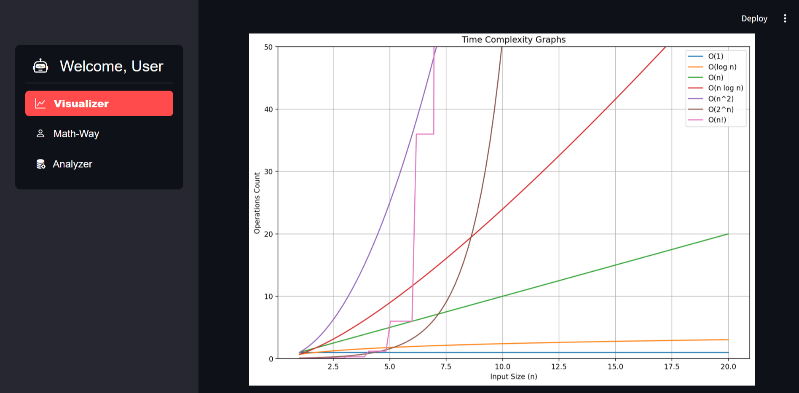
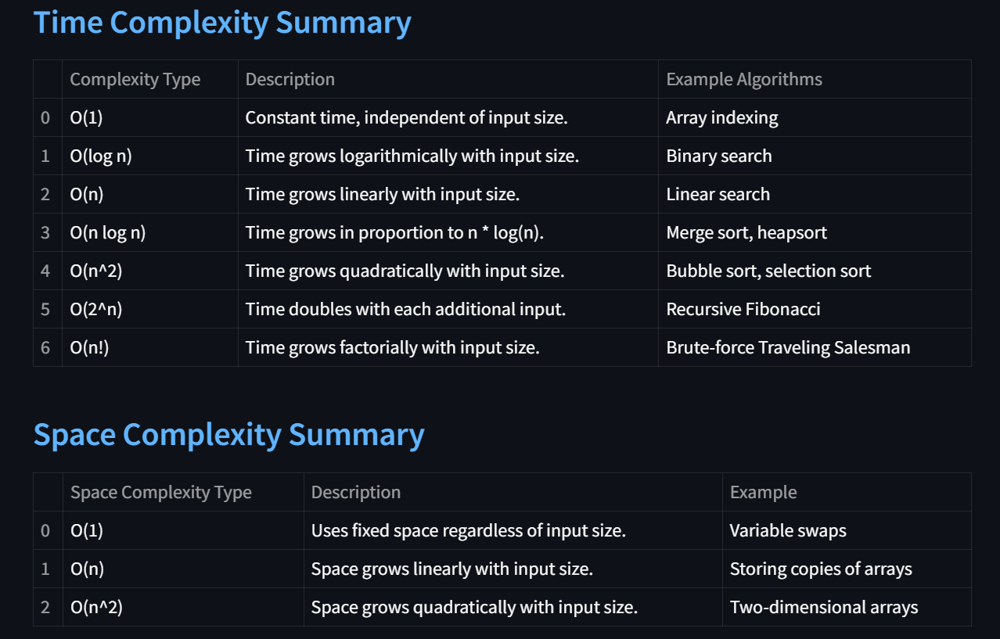
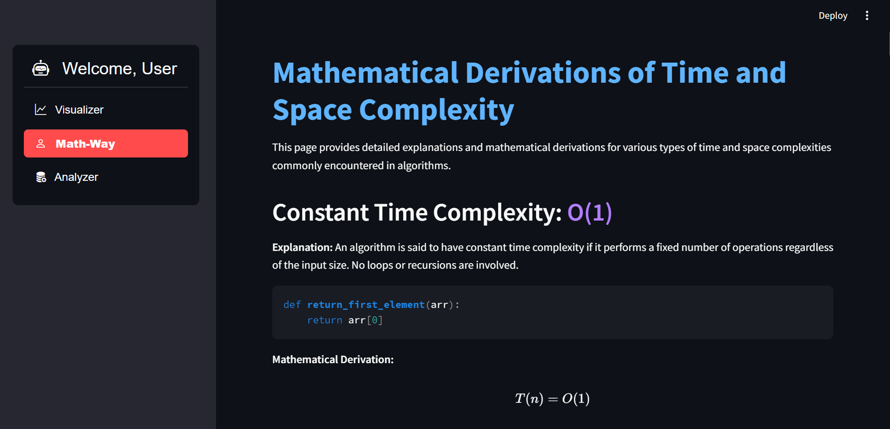
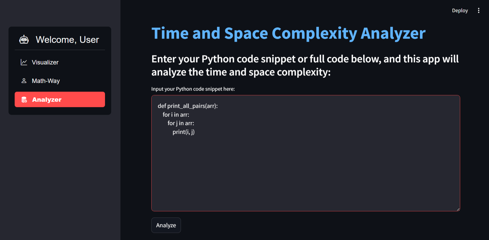

# Mathematical Derivations and Visualization of Time and Space Complexity

This project provides detailed explanations and mathematical derivations of common time and space complexities encountered in algorithms, all presented using **Streamlit** for a dynamic and interactive user experience.






## 🧠 Overview

Understanding the time and space complexity of algorithms is crucial for analyzing their efficiency. This project walks through the derivation of various complexities including constant, linear, quadratic, logarithmic, exponential, and factorial, and provides Python code examples for each case.

## 🔍 Features

- **Detailed Derivations**: Mathematical explanations for different time complexities.
- **Interactive Visualization**: Explore complexities with example code for better understanding.
- **Real-World Examples**: From simple loops to recursive algorithms like **Merge Sort** and **Binary Search**.
- **Space Complexity**: Explanation and examples for both auxiliary space and recursive space.

## 📂 File Structure

- `app.py`: Contains the Streamlit app which explains and visualizes time and space complexities.
- `README.md`: You're here! Detailed project information and instructions.
- `requirements.txt`: List of Python packages required to run the Streamlit app.

## 📖 Complexity Types Covered

1. **Constant Time Complexity**: `O(1)`
2. **Linear Time Complexity**: `O(n)`
3. **Quadratic Time Complexity**: `O(n^2)`
4. **Logarithmic Time Complexity**: `O(log n)`
5. **Linearithmic Time Complexity**: `O(n log n)`
6. **Exponential Time Complexity**: `O(2^n)`
7. **Factorial Time Complexity**: `O(n!)`
8. **Space Complexity**: `O(n)`

## 🚀 How to Run

1. **Clone the repository**:
    ```bash
    git clone https://github.com/your-username/your-repo-name.git
    cd your-repo-name
    ```

2. **Install the dependencies**:
    ```bash
    pip install -r requirements.txt
    ```

3. **Run the Streamlit app**:
    ```bash
    streamlit run app.py
    ```

## 💡 Usage

Once the app is running, you'll be able to explore the mathematical derivations of time and space complexities through the interactive interface.

## 🤝 Contributing

Contributions are welcome! Feel free to fork the repository, make changes, and submit a pull request. For any issues, suggestions, or feature requests, please open an issue on GitHub.

## 🛠️ Technologies Used

- **Python**
- **Streamlit**
- **LaTeX** for rendering mathematical formulas

## 📜 License

This project is licensed under the MIT License. See the [LICENSE](LICENSE) file for more details.
